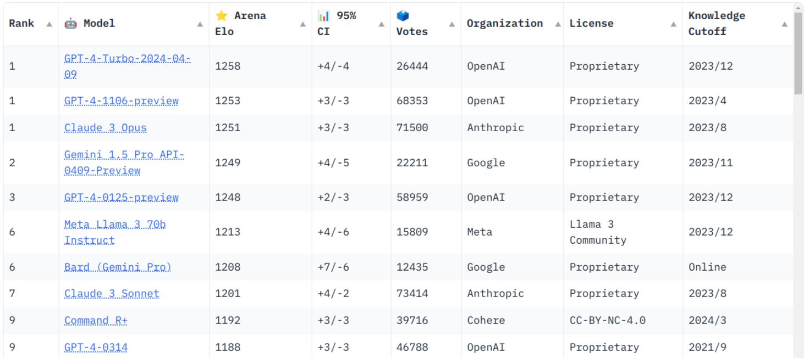

# A GPT of One's Own

May 2024

David Eger


Though I'm a programmer, I have studiously avoided learning Javascript and CSS.


And until a few weeks ago, I'd largely ignored the GPT ChatBots: When I first tried them, they hallucinated badly and led me astray when I asked them how to use various programming libraries.  But [Simon Willison](http://simonwillison.net/) and others have been using them to get things done with surprising ease.  So two weeks ago, I asked Google's Gemini 1.5 the following:

```
I have an HTML table, and for each row I have a pair of numbers [low, high]
in the first column.  I would like to make this first column more visual
by rendering the interval as a rectangle aligned along the x axis within
each cell, so that you can quickly see how the intervals in each row
relate to each other.  Could you show an example HTML table that renders this way?
```

I was shocked at just how good the answer was.  Gemini taught me about explicitly attaching [data fields](https://developer.mozilla.org/en-US/docs/Learn/HTML/Howto/Use_data_attributes) to HTML tags (woah, when did that happen?), and gave me idiomatic CSS and javascript to accomplish what I wanted.  Copy, paste, ask one follow up and I was done.  What would have been hours for me turned into a couple of minutes.

# [Llama 3](https://llama.meta.com/llama3/): an excellent, free AI you can run at home

April 2024 saw a flurry of AI model announcements: [Reka Core](https://www.reka.ai/news/reka-core-our-frontier-class-multimodal-language-model), Microsoft's [Phi 3](https://export.arxiv.org/abs/2404.14219), Cohere's [Command R+](https://cohere.com/blog/command-r-plus-microsoft-azure).  But standing out was Meta's release of its open  [Llama 3](https://llama.meta.com/llama3/), a model scoring 1213 in the [LMSYS Chatbot Arena Leaderboard](https://chat.lmsys.org/?leaderboard), less than 50 [elo points](https://en.wikipedia.org/wiki/Elo_rating_system) away from the best AI models Gemini 1.5 and GPT-4:



Llama 3 has shortcomings: It is text only (whereas [Gemini 1.5](https://ai.google.dev/gemini-api/docs/models/gemini) can process text, images, and video), and  has a relatively modest context window of 8k tokens.  The latest AIs now use [Ring Attention to make very large contexts possible](https://learnandburn.ai/p/how-to-build-a-10m-token-context).

But for short conversations, the release of Llama 3 means: *you can now run a cutting-edge AI at home*!

# Using Chatbots already running in someone's cloud

Many sites now let you chat with AI Chatbots for free (often smaller versions of the best models) on some fairly beefy hardware (e.g. NVidia H100's, LPUs, TPUs, etc).  And before you get too excited about what you might do on your own hardware, give these AI tools a try online.

## Open chatbot playgrounds

+ [LMSYS leaderboard](https://chat.lmsys.org/?leaderboard): try models blind and vote for the best AI.
+ [Groq](https://groq.com/) provides blazing fast inference for public models (LLama 70B, Gemma, Mixtral) from an [AI hardware startup](https://www.youtube.com/watch?v=Z0jqIk7MUfE)
+ [HuggingChat](https://huggingface.co/chat/models/microsoft/Phi-3-mini-4k-instruct) offers access to 8 Open LLMs.
+ [Vercel.ai](https://sdk.vercel.ai/) is another free LLM comparison site

## Proprietary Chat Bots:

The very best chat bots are *quite* large.  Google hasn't reported just how big Gemini 1.5 Pro is.  GPT-4 was rumored to be a [1.7T parameter Mixture of Experts](https://twitter.com/swyx/status/1671272883379908608).  But many of the leading contenders have dedicated chat sites:


+ [GPT-4 Turbo](https://chat.openai.com/) (OpenAI). 128k token context window. Multimodal
+ [Claude](https://claude.ai/chat) (Anthropic) and [Anthropic Workbench](https://console.anthropic.com/workbench)
+ [Gemini 1.5 Pro](https://gemini.google.com/) (Google).  128k token context window.  Multimodal
+ [Coral or Command R+](https://coral.cohere.com/) (Cohere)
+ [Reka AI](https://chat.reka.ai/)
+ [Perplexity](https://perplexity.ai/)
+ [Arctic](https://arctic.streamlit.app/) (Snowflake) a 480B parameter model

# Running Llama 3 at home

Here are three easy options for running a Large Language Model [locally](https://www.reddit.com/r/LocalLLaMA/) on your own hardware:

+ [llamafile](https://github.com/Mozilla-Ocho/llamafile)  
llamafile is a format of LLM executable you can download, for example [Meta-Llama-3-70B-Instruct-llamafile](https://huggingface.co/jartine/Meta-Llama-3-70B-Instruct-llamafile).  
This is by far the easiest method.  Download a single [portable executable](https://justine.lol/ape.html) made by [@JustineTunney](https://twitter.com/JustineTunney) that includes the [llama.cpp](https://github.com/ggerganov/llama.cpp) inference engine and a language model.  It will run on on Windows, Linux or Mac.

+ [ollama](https://ollama.com/)  
  ollama is a golang app wrapping llama.cpp.  Tell it what model you want by name, and it will download and run it in a local docker container. Models are saved in `/usr/share/ollama/.ollama/models`  
  ```sh
  # install ollama
  curl -fsSL https://ollama.com/install.sh | sh
  # Run the 8B llama3 model
  ollama run llama3
  ```


+ [llama.cpp](https://github.com/ggerganov/llama.cpp)  
llama.cpp is a from-scratch LLM inference engine by [@ggerganov](https://twitter.com/ggerganov)
This engine and its sister [whisper.cpp](https://github.com/ggerganov/whisper.cpp) impressed the world with how easy it was to run cutting edge AI models on consumer CPUs.  It forms the core of the above two options and has attracted major contributions from across the industry to make it run well on a wide array of hardware.  
    ```sh
    git clone https://github.com/ggerganov/llama.cpp
    cd llama.cpp
    # See the readme for more advanced build options
    cmake -B build
    cmake --build build --config Release
    # Download a Model
    wget -O Phi-3-mini-4k-instruct-q4.gguf  https://huggingface.co/microsoft/Phi-3-mini-4k-instruct-gguf/resolve/main/Phi-3-mini-4k-instruct-q4.gguf?download=true
    # Run the chat.
    make -j 20 && ./main -m ./Phi-3-mini-4k-instruct-q4.gguf -p "Building a website can be done in 10 simple steps:\\nStep 1:" -n 400 -e
    ```

# Which ChatBot *should* you run?  which *can* you run?

[Llama 3](https://llama.meta.com/llama3/) was released with two variants: 8B parameters and 70B parameters.  Which one to run depends critically on two questions.

## Quantization: How much RAM do you need?

"Parameters" in a model refer to the floating point
weights in the neural net.  The more bits you use for each parameter, the more
accurate your math will be, but the more memory you will need.
As Finbarr Timbers describes in [How is LLaMa.cpp
possible?](https://finbarr.ca/how-is-llama-cpp-possible/), running
"inference" in a language model, especially for a single chat session,
is *dominated by the amount of RAM being accessed*.

Perplexity measures how faithfully an LLM represents the statistics of a language -- so it's often used as a measure of how much accuracy you lose when reducing the precision of the weights in a neural net.  Ways of approximating, say, 16 bit floating point numbers in fewer
bits are called quantization.  The [AWQ](https://arxiv.org/abs/2306.00978) and [QuaRot](https://arxiv.org/pdf/2404.00456) quantization methods have empirically produced models that  retain 99% of the perplexity of the original 16 bit models using only 4 bits per parameter(!)  This magical result that [4 bits per parameter is optimal](https://arxiv.org/abs/2212.09720) was confirmed by Tim Dettmers and [blind user testing](https://github.com/ggerganov/llama.cpp/discussions/5962), though results rapidly degrade when trying to quantize these models to fewer than 4 bits per parameter.

So, assuming 4 bit quantization:
+ For Llama 3 70B you need at least 35 GB of RAM
+ For Llama 3 8B you need at least 4GB of RAM

## How much better is a larger model?

 An RTX 4090 costs about $2k and has 24GB of VRAM.  To run inference on the larger 
 [Llama 3](https://llama.meta.com/llama3/) and attempt to accelerate them with consumer GPUs, you would need two such GPUs to cover the 35GB of VRAM needed to load the model.
 
 So is the larger model worth the incremental value?  What about other models out there? How good are they?

| Model                                                                                               | License        | \# 4090s | Params (B) | [ARC-C](https://huggingface.co/datasets/allenai/ai2_arc) | [MMLU](https://huggingface.co/datasets/cais/mmlu)  | [GSM8K](https://huggingface.co/datasets/gsm8k) | [GPQA](https://huggingface.co/datasets/Idavidrein/gpqa) | [HumanEval+MBPP+ Avg](https://evalplus.github.io/leaderboard.html) | [HumanEval](https://arxiv.org/pdf/2404.14219) |
| --------------------------------------------------------------------------------------------------- | -------------- | -------- | ---------- | ---------------- | ----- | ----- | ---- | ------------------- | ---- |
| [gpt-4-turbo-2024-04-09](https://github.com/openai/simple-evals)    | $              | many | ?   |      | 86.5  | 93    | 49.1 | 86.6 | 87.6 |
| [Claude-3-Opus](https://www.anthropic.com/news/claude-3-family)    | $              | many | ?   | 96.4 | 86.8  | 95    | 49.7 | 76.8 | 84.9 |
| [Gemini Pro 1.5](https://storage.googleapis.com/deepmind-media/gemini/gemini_v1_5_report.pdf)	|$ |	many	| ?| |	81.9 | 91.7 | 41.5 | 61 | 71.9 |
| [meta-llama/Meta-Llama-3-70B-Instruct](https://huggingface.co/meta-llama/Meta-Llama-3-70B-Instruct) | Llama 3 CLA \* | 2    | 70  | 85.3 | 80.06 | 85.44 | 39.5 | 70.7 | 68.3 |
| [CohereForAI/c4ai-command-r-plus](https://huggingface.co/CohereForAI/c4ai-command-r-plus)  | CC-BY-NC \*    | 3    | 104 |      | 75.73 | 70.74 |      | 56.7 | 64   |
| [microsoft/Phi-3-mini-128k-instruct](https://huggingface.co/microsoft/Phi-3-mini-128k-instruct)   | MIT            | 1    | 3.8 | 84.9 | 68.7  | 69.52 | 32.8 |      | 57.9 |
| [mistralai/Mixtral-8x22B-Instruct-v0.1](https://huggingface.co/mistralai/Mixtral-8x22B-Instruct-v0.1)    | Apache 2.0     | 4    | 176 |      | 77.77 | 82.03 |      | 34.1 | 39.6 |
| [meta-llama/Meta-Llama-3-8B](https://huggingface.co/meta-llama/Meta-Llama-3-8B)    | Llama 3 CLA \* | 1    | 8   | 80.5 | 66.49 | 45.34 | 34.2 | 29.3 | 60.4 |
| [google/gemma-7b-it](https://huggingface.co/google/gemma-7b-it)    | Gemma \*       | 1    | 7   | 78.3 | 53.52 | 29.19 |      | 24.4 | 17.7 |


The "frontier models" like Gemini Pro 1.5 are *really good*.  Like, slight tweaks of Gemini get [a score of 91.1% US Medical Licensing Exam](https://arxiv.org/pdf/2404.18416)  You can be a licensed doctor in the US with a score of [about 60%](https://www.usmle.org/bulletin-information/scoring-and-score-reporting).  [Llama 3 70b gets 88% on the USMLE](https://ai-assisted-healthcare.com/2024/04/21/llama3-70b-performs-on-par-with-gpt-4-turbo-on-answering-usmle-questions/) while its smaller 8B sibling gets about [66%](https://ai-assisted-healthcare.com/2024/04/21/llama3-70b-performs-on-par-with-gpt-4-turbo-on-answering-usmle-questions/).  If you need medical advice, do you really want to ask a doctor who barely passed their licensing exam?  Run the 70B model.

How about programming ability?  The final two columns cover that. [HumanEval](https://arxiv.org/pdf/2404.14219) was an early basic Python programming test suite, and  HumanEval+MBPP+ Avg is a [much expanded](https://openreview.net/forum?id=1qvx610Cu7) version.  GSM8K is a set of grade school math word problems.  From the scores above, you can see: if you need coherent reasoning or the ability to write *good code* use a paid chatbot (Gemini, GPT-4, Claude-Opus) or run Llama 70B.

If you're generating a horoscope reading, any of the above models is probably fine.

> *About the above standardized test scores*
> 
> The above table's numbers are taken from either (a) the [Open LLM Leaderboard](https://huggingface.co/spaces/HuggingFaceH4/open_llm_leaderboard) (b) the model's technical report, or (c) a leaderboard associated with the linked test set.
>
> Huggingface's Open LLM Leaderboard team found getting scores for supposedly standardized problem sets is [fraught with subtleties](https://huggingface.co/blog/open-llm-leaderboard-mmlu). How exactly do you prompt the model?  How do you evaluate whether the free-form output is the "right answer"?  If giving examples is part of your prompt, how many examples do you give?  Do you do [Chain of Thought](https://github.com/logikon-ai/awesome-deliberative-prompting/#readme) prompting?  Further complicating things, general methods pop up to "uplevel" a base AI model to think better each week: [RLHF](https://huggingface.co/blog/rlhf), [DPO](https://openreview.net/forum?id=HPuSIXJaa9), [IPO](https://arxiv.org/pdf/2404.19733) are just a few.
>
> \* The licenses even for relatively "open" models often come with prohibitions against using them for illegal or societally negative activities, making too much money from them, using them to improve your own model, or not giving prominent credit to the model.


# Do you... even need a Fancy GPU?

Though you may think you need an expensive, powerful, RTX 4090 or an H100 to run a chatbot, you can get reasonable speed on small models even with a mobile CPU, and decent performance if you have a fancy mac.

| Model | CPU / GPU | [Memory Bandwidth](https://finbarr.ca/how-is-llama-cpp-possible/) | generation speed |
| ----- | -------- | ------ | ------ |
| Llama 2 7B Q4_0 | Pixel 5| 13 GB/s | [1 tok/s](https://twitter.com/rgerganov/status/1635604465603473408) |
| Llama 3 8B Q4_0 | Ryzen 5900X + 64GB DDR4 | 50 GB/s |  10 tok/s |
| Llama 3 8B Q4_0 | M1 + 16GB LPDDR4X | 66 GB/s |  11.5 tok/s |
| Llama 3 8B Q4_0 | Ryzen 5900X + 64GB DDR4 + GTX 1080 8GB | 320 GB/s |  31 tok/s |
| Llama 2 7B Q4_0 | M1 Pro | 200 GB/s | [36 tok/s](https://github.com/ggerganov/llama.cpp/discussions/4167) |
| Llama 2 7B Q4_0 | M2 Ultra | 800 GB/s | [94 tok/s](https://github.com/ggerganov/llama.cpp/discussions/4167) |
| Llama 2 7B Q4_0 | 7900 XTX | 960 GB/s | [131 tok/s](https://blog.mlc.ai/2023/08/09/Making-AMD-GPUs-competitive-for-LLM-inference)
| Llama 2 7B Q4_0 | RTX 4090 | 1008 GB/s | [159 tok/s](https://blog.mlc.ai/2023/08/09/Making-AMD-GPUs-competitive-for-LLM-inference)

For a single interactive chat session, running on a CPU with lots of memory is similarly fast to a GPU with similar memory bandwidth.  Running across multiple GPUs [can be made to work](https://blog.mlc.ai/2023/10/19/Scalable-Language-Model-Inference-on-Multiple-NVDIA-AMD-GPUs), but is [not necessarily trivial](https://github.com/ggerganov/llama.cpp/issues/3051).  For the big models, you really *must* have a high end Mac, use the cloud, or install several GPUs to get a reasonable speed.


| Model | CPU / GPU | Power| Memory Bandwidth  | generation speed |
| ----- | -------- | ------ | ------ | ----- |
| Llama 3 70B Q5_KM | Ryzen 5900X + 64GB DDR4 | 105 W | 50 GB/s |  0.96 tok/s |
| Llama 3 70B Q5_KM | Ryzen 5900X + 64GB DDR4 + GTX 1080 8GB (-ngl 8) | 285 W | 320 GB/s |  0.99 tok/s |
| Llama 3 70B f16  | AMD Threadripper Pro 7995WX + DDR5 | 350 W | 500 GB/s |  [5.9 tok/s](https://huggingface.co/jartine/Meta-Llama-3-70B-Instruct-llamafile) |
| Llama 3 70B Q4_0 | M2 Ultra 128GB | 90 W | 800 GB/s |  [14 tok/s](https://huggingface.co/jartine/Meta-Llama-3-70B-Instruct-llamafile) |
| Llama 3 70B Q4_0 | 2x RTX 3090 24GB or 2x RTX 4090 24GB | 1050 W | 2016 GB/s |  [20 tok/s](https://www.reddit.com/r/LocalLLaMA/comments/18dbnxg/anyone_done_the_numbers_on_the_new_threadripper/) |
| Llama 2 70B FP8 | Nx H100s @ perplexity.ai| Nx 700 W| Nx 2,000 GB/s |  [30 tok/s](https://github.com/ray-project/llmperf-leaderboard) |
| Llama 3 70B FP16 | Groq LPUs @ groq.com | Nx 215 W  | Nx 80,000 GB/s | [185 tok/s](https://github.com/ray-project/llmperf-leaderboard) |

The unlinked stats above I got at home running a `llamafile`.  Nvidia, AMD and friends are pushing each month to optimize the LLM use case, so you may be able to get somewhat faster generation using their [ChatRTX](https://www.nvidia.com/en-us/ai-on-rtx/chatrtx/) app and its underlying [TensorRT-LLM](https://developer.nvidia.com/blog/turbocharging-meta-llama-3-performance-with-nvidia-tensorrt-llm-and-nvidia-triton-inference-server/) library, but [it may be tricky to get it running](https://www.reddit.com/r/LocalLLaMA/comments/1b4iy16/is_there_any_benchmark_data_comparing_performance/)

# Conclusion as of 2 May 2024

+ Running a high end AI model at home (Llama 3 70B) is doable but painfully slow for $2k, and reasonable at $6k.
+ If you have GPUs but they don't have enough VRAM for your model, they don't buy you much!
+ A high end Mac is extremely competitive and uses much less power than a multiple-GPU PC for LLM inference.
+ [groq](https://groq.com/) is *so much faster* than running it yourself, that if you're just talking to Llama 3... just use groq., the release of Llama 3 means: *you can now run a cutting-edge AI at home*!

