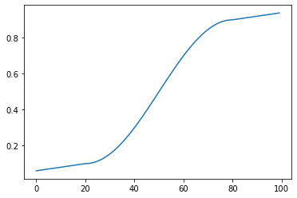

# Microbenchmarks are a 💔 Hotel
## watch out, or that speedy library may just break your heart
### ... and why every data scientist should check out ❤️ Ray

David Eger  *Draft as of August 10, 2021, for private review*

I do a good bit of data analysis in Jupyter notebooks with Pandas.

The plotting and easy data analysis enabled by Python's `pandas`, `numpy`,
and `sklearn` libraries are so good that they've made Jupyter Notebooks the
de facto environment for the ML world in 2021, used by everyone from the ML training
grounds of [Kaggle](https://kaggle.com/) and [fast.ai](https://www.fast.ai/) to
the cutting edge Research teams at [DeepMind](https://github.com/deepmind/dm-haiku/blob/main/examples/haiku_lstms.ipynb),
[Facebook Research](https://colab.research.google.com/drive/16jcaJoc6bCFAQ96jDe2HwtXj7BMD_-m5).

That said, scaling up from exploratory data analysis to production
deployment often involves *rewriting* chunks of code you built on
`sklearn` or `pandas` with more efficient versions of the
same, which people often do in C++.   The type flexibility that `pandas`
provides in exploring your datasets and writing snippets of code comes at a cost:
all values in Python are [boxed](http://jakevdp.github.io/blog/2014/05/09/why-python-is-slow/),
so every expression you execute does type checking and pointer chasing under the hood.

As you might imagine, developing data science insights on an interactive platform
only to rewrite them on a completely separate stack has its disadvantages.

## Python Trends: becoming the fastest on the planet, at least for pure numerics

To take advantage of the flexibility and interactivity of Python,
developers have wired up C++ libraries like `numpy` to minimize the amount of
computation your Python interpreter actually performs.  Python objects still
orchestrate things, but they're lightweight handles to efficiently packed vectors
of uniformly typed machine words.  The compute is offloaded to natively (compiled)
routines.

Even more interesting, the folks in  Google's Brain and DeepMind teams have
now connected the Python runtime directly to the [LLVM](https://llvm.org/) compiler
and built it an optimizing linear algebra library ([XLA](https://www.tensorflow.org/xla/architecture))
that produces *much faster code* than the naive C++ codes you might have written.
Many [PhD](https://dspace.mit.edu/handle/1721.1/89996) [theses](https://www.aartbik.com/sparse.php)
have been written on how to make matrix math go fast, and XLA means
your matmuls get shoved through a [systolic array](https://www.youtube.com/watch?v=s6SXj3v-a38&t=5148s)
if you've got one, multiply-and-adds get "fused" to take advantage of your hardware's native abilities,
and your numerics get sliced into chunks sized just so to optimize the usage
of your accelerator's cache hierarchy.

Beyond these feats, Google's `JAX` team took Mike Innes's audacious 2017 challenge:

> Can we build systems that treat numerics, derivatives and parallelism as first-class features, without sacrificing traditional programming ideas and wisdom?
>  -[Mike Innes](https://mikeinnes.github.io/2017/12/06/ml-pl.html)

and answered it with an affirmative *for Python.*  With [JAX](https://github.com/google/jax)
you now have [Automatic](https://marksaroufim.medium.com/automatic-differentiation-step-by-step-24240f97a6e6)
[Differentiation](https://github.com/MikeInnes/diff-zoo), just like you do in
tensorflow and your code can *look just like mathematics*.  You write your function
as you normally would in `numpy`, and when you need to take a derivative
(as you do in order to implement stochastic gradient descent)
you just pass your code to `jax.grad()` and get the derivative "for free,"
*even if your code has loops, branches, or calls to np.sin().*

Added together, these improvements boosted Python — poor, slow Python,
the whipping boy that's [60,000 times slower](https://science.sciencemag.org/content/368/6495/eaam9744)
than optimized C++ run on a CPU — to set world records for the *fastest code on the planet*
at the [2020 MLPerf](https://cloud.google.com/blog/products/ai-machine-learning/google-breaks-ai-performance-records-in-mlperf-with-worlds-fastest-training-supercomputer) 
competition.

## Jumping onto the Bandwagon

All of this sounds splendid!

Native Python code is slow, but using specialized libraries make it even faster than C++.

Hearing all of this made me wonderfully optimistic, especially after running a couple of
microbenchmarks to verify that some of my inner loops were *2x faster* using some of
these new fancy fast libraries.  The 💔 part came when I tried to actually *convert my code*
and got *2x slower results*.

> **But why didn't you just...?**  If you think this to yourself below,
> you're right. Gold star.  There *is* a better way to do all of the below.
> The point of these examples is to show how easy it is to go off the rails
> when swapping in usage of a fast new library.


## Microbenchmark #1: `jax.jit` 💔 Hotel

As in many applications, I often have some sort of piecewise function to evaluate
in my innermost loop.  Here's a relatively simple one I might evaluate, mapping
inputs `0.0 - 100.0` to `0.0 - 1.0` with a nice curve:



```py
import numpy as np
import math

breaks = [20, 80]
f1   = lambda x: 0.1 - (breaks[0] - x) * 0.002
f2   = lambda x: 0.5 - 0.4 * np.cos((x - 20.) * math.pi / 60.)
f3   = lambda x: 0.9 + (x - breaks[1]) * 0.002
pw_fns   = [f1,  f2, f3]

def fn(x):
  index = np.searchsorted(np.array(breaks), x)
  return pw_fns[index](x)
```

Translating this into `jax` with the helpful
[tip](https://stackoverflow.com/questions/67985944/efficient-way-of-graph-based-polynomial-evaluation-with-different-coefficients/67990928)
of JAX team member Jake VanderPlas is straight forward:

```py
import jax
import jax.numpy as jnp

f2j  = lambda x: 0.5 - 0.4 * jnp.cos((x - 20.) * math.pi / 60.)
pwj_fns  = [f1, f2j, f3]

@jax.jit
def fn_jit(x):
  bounds = jnp.array(breaks)
  index = jnp.searchsorted(bounds, x)
  return lax.switch(index, pwj_fns, x)
```

On the Xeon(R) Platinum 8173M I hosted my notebook on (the CPU
you're on will greatly affect your results) evaluating these
functions on 5000  inputs show the jax-ified `fn_jit` to
be **20% faster** than the equivalent numpy `fn`, and if you use 
`jax`'s handy vectorization `vmap`, evaluating the function 5000
times is **60x as fast**!

```py
def reify(xs):
  # Make sure that all of the values in the list xs have actually
  # been computed down to float values.  Otherwise jax may have
  # just "started" the computation asynchronously, haha!
  #  https://jax.readthedocs.io/en/latest/faq.html#benchmarking-jax-code 
  return [float(x) for x in xs]

rand_vecs = np.random.rand(5000, 3) * 100.
```

```py
%%timeit
_ = reify([fn(s) for s in rand_vecs[:, 0]])
```
`10 loops, best of 5: 50 ms per loop`


```py
%%timeit
_ = reify([fn_jit(s) for s in rand_vecs[:, 0]])
```
`10 loops, best of 5: 40 ms per loop`


```py
%%timeit
_ = reify(jax.vmap(fn_jit)(rand_vecs[:, 0]))
```
`1000 loops, best of 5: 2.54 ms per loop`

This looks great!  Now I'm not quite ready to rewrite my whole stack of code in pure
jax — I'm still exploring data with pandas — but even that 20% speed up
looks great,  so let's just start by swapping in `fn_jit` for `fn` down in the middle
of my inner loop.

Now this piecewise function evaluation was not the whole of the code in my inner loop,
just the hottest section, and was called from code like this:

```py
def my_exp(p, q, r):
  return p * q / (1.0 + r)

def full_code(v):
  return my_exp(fn(v[0]), v[1], v[2])

%timeit _ = reify([full_code(rand_vecs[i]) for i in range(rand_vecs.shape[0])])
```
`10 loops, best of 5: 53 ms per loop`

So if I just swap that call to `fn` to a call to `fn_jit`, the microbenchmark says I should get a nice speed up:

```py
def full_code_jit(v):
  return my_exp(fn_jit(v[0]), v[1], v[2])

%timeit _ = reify([full_code_jit(rand_vecs[i]) for i in range(rand_vecs.shape[0])])
```
`1 loops, best of 5: 3.2 s per loop`

But instead I get a **60x slow down**!  So what happened?
Why do we land in this heartbreak of disappointment?

While the `jit`'d version of our piecewise function *on its own* is faster, the type it
returns is not a Python `float`, it's a
`type(fn_jit(5)) == google3.third_party.tensorflow.compiler.xla.python.xla_extension.DeviceArray`.

This specialized type is optimized for being stored and computed on a device that does all the numeric
computation (GPU, TPU, AVX registers) and usually is not manipulated by the Python interpreter at all.
If you naively use this type in Python expressions, every time Python executes an operation
it has to think about how to unbox the value from this specialized `xla`
container and find the right function to compute a multiply or add
of this thing against a native float.
Remember, native Python is slow.   So even though you can "just write numpy
like you used to" and "get much faster results through the magic of jax and xla,"
you'll only get the full benefit of those lightning-fast speedups if your code
is pure numeric and fully rewritten to jax so it can all run on your accelerator.

That said, all is not necessarily lost.  Now that we know what's going on,
we *can* get some of the speed up we saw in our microbenchmark, we just have
to be very careful to coerce results from our `jit`'d function back
to "Python native" floats when we're coming out of jax land:

```py
def full_code_jit_cast(v):
  return my_exp(float(fn_jit(v[0])), v[1], v[2])

%timeit _ = [full_code_jit_cast(rand_vecs[i]) for i in range(rand_vecs.shape[0])]
```
`10 loops, best of 5: 50 ms per loop`

A 5% speed up: not bad.


**Takeaway:** `jax` is best used when you're converting a *large numeric
computation, preferably most of your program, into a giant numeric subroutine.*
It *can* be used piecemeal, but if you're doing so, be careful to coerce your 
types to python native floats or numpy arrays when switching back to
native Python land.

## Microbenchmark #2: Polars dataframes 💔 Hotel

In 2021 we've reached the End of Moore's law.  Our chips are not getting faster,
branches are disastrous, and in typical code our cores spend most of their time
idle waiting on memory.

Pandas queries are database-like operations and can be greatly accelerated in
this new world by *vectorizing their execution*.  This both minimizes branches
and effectively utilizes processor caches and execution units by operating column-wise
over your data.  Ritchie Vink ran with [this idea](https://www.ritchievink.com/blog/2021/02/28/i-wrote-one-of-the-fastest-dataframe-libraries/)
and in 2020 implemented a Pandas replacement called [Polars](https://github.com/pola-rs/polars) which benchmarks
[5-10x faster than pandas](https://h2oai.github.io/db-benchmark/) at least for large dataframes.

Since much of my development is in Pandas, getting a *5-10x* speed up sounds great!

So let's take an application: summarizing reviews for restaurant listings.  Input data
would be a table of review data something like this (we omit a few columns here, for
example the actual review text):


| stars   | reviewer_id |	review_age_weeks | primary_topic |	for_business | text_length | text_quality |	language |
| ------ | ----------- | ----------------  | ------------- | --- | --- | --- | ---- |
| 3 |	3172 |	10	| "atmosphere"	 | false| 115	 | 0.97 |	"es" |
| 3 |	8100 |	23	| "food" 	| false	| 46	| 0.86 |	"en" |
| 5 |	7470 |	45	| "food" 	| true	| 58	| 0.91 |	"en" |
| 3 |	8664 |	19	| "location"	|	false |	43 |	0.95 |	"en" |
| 2 |	8243 | 11 | "location" | false	| 251 |	1	 | "en" |
| 1	| 6626 | 28  | "location"	 |	false |	181 |	1	 | "en" |

We'll have two goals for our summarization benchmark:

a. Select a few diverse reviews to show on the first page.
b. Calculate this restaurant's rank vs all other restaurants for
   each rating aspect: "atmosphere", "food", "speed", "location", and "friendliness."

Since we want to show what's both good and bad about the restaurant, we'll choose a few
reviews from each star rating bucket to show.  In pandas, we use the following code to
choose which reviews to show:

```py
def pd_get_representative_reviews(df, depth=2):
  return df[df.language == 'en'].sort_values(by=['stars', 'review_age_weeks']).groupby('stars').head(depth)
```

In polars, the equivalent code is thankfully very similar (though if
you know the particular fields you need at the end, selecting them explicitly
will make this code *even* faster):

```py
def pl_get_representative_reviews(df, depth=2):
  return df[df.language == 'en'].sort(['stars', 'review_age_weeks']).groupby('stars').head(depth).sort(['stars', 'review_age_weeks'])
```

After that, we'll use identical code for calcluating each listing's aspect ranks; we'll
go into that later.  Benchmarking these two routines against 25,000 dataframes
which follow the sort of Zipfian review count distribution you might expect —
a few popular restaurants with thousands of reviews, many restaurants with
only one or two — confirms that Polars is a real winner here,
at least running on a free 2-core Google colab instance:

```
Pandas finding representative reviews for 25000 synthetic listings + no post processing
CPU times: user 2min 49s, sys: 3.35 s, total: 2min 52s
Wall time: 2min 52s

Pandas finding representative reviews for 25000 synthetic listings + rank finding
CPU times: user 4min 12s, sys: 4.19 s, total: 4min 17s
Wall time: 4min 15s

Polars finding representative reviews for 25000 synthetic listings + no post processing
CPU times: user 45.5 s, sys: 21.8 s, total: 1min 7s
Wall time: 49.7 s

Polars finding representative reviews for 25000 synthetic listings + rank finding
CPU times: user 2min 10s, sys: 23.8 s, total: 2min 34s
Wall time: 2min 16s
```

This is *great*!  We getting a **3.7x** speed up wall time wise and a **2.5x** 
speed up for core time.
But something *very* strange happens when we run  *the same code* on a workstation:

```
Pandas finding representative reviews for 25000 synthetic listings + no post processing
CPU times: user 1min 39s, sys: 2.41 s, total: 1min 41s
Wall time: 1min 41s

Pandas finding representative reviews for 25000 synthetic listings + rank finding
CPU times: user 2min 24s, sys: 3.29 s, total: 2min 27s
Wall time: 2min 27s

*CPU History: Over 75000 records, computation jumped core at least 33 times.*

Polars finding representative reviews for 25000 synthetic listings + no post processing
CPU times: user 3min 3s, sys: 2min 17s, total: 5min 21s
Wall time: 43.9 s

Polars finding representative reviews for 25000 synthetic listings + rank finding
CPU times: user 13min 17s, sys: 8min 15s, total: 21min 33s
Wall time: 5min 23s

*CPU History: Over 75000 records, computation jumped core at least 48758 times.*
```

What the *what*?  Running on a different machine now makes our Polars-enhanced
Python routine *more than twice as slow* and uses **8x** much core time.

It turns out, it's not the version of Python or Polars installed, but
rather the game of musical chairs that happens each time polars code gets
run and the way in which our rank calculation is coded.

Ahead of time, we calculate for each listing its per-aspect star
rating — one for `food`, one for `atmosphere` etc.  So for our 25,000
listings and 5 aspects we have a table of 125,000 floats, which pandas
(and for that matter polars) by default store as float64's, adding up
to about a megabyte of data.  We sort these lists and store them in
sorted `np.array`s and then at run time scan these using `np.searchsorted`
to find each listing's aspect rank in the sorted list.

On my workstation's 12 core
[Xeon(R) W-2135 CPU @ 3.70GHz](https://ark.intel.com/content/www/us/en/ark/products/126709/intel-xeon-w-2135-processor-8-25m-cache-3-70-ghz.html)
each time Python wakes up from a multi-core Polars frenzy, it lands somewhat
arbitrarily on a different core (see the core jump counts above).
Waking up on a new core, that 1 megabyte of  reference data?
It's not in the L1 cache.  And since Skylake's L3 cache 
access time is about [12x slower](https://www.anandtech.com/show/11544/intel-skylake-ep-vs-amd-epyc-7000-cpu-battle-of-the-decade/13)
than its L1 access time, and since most of what this code is doing is scanning
this megabyte of data, well, it's not hard to see how you could take 10x as long to run the same computation.

Code: [Google Colab notebook](reviews/Public_Google_Colab_Synthetic_Reviews_Dataframe_Benchmark.ipynb) [as Standalone Python](reviews/run_synthetic_benchmark.py)

**Takeaway**: Be very careful mixing "native Python" code with Polars queries over small dataframes.
Polars is amazingly performant for otherwise expensive queries over large dataframes, but without careful
coding you may end up throwing a spanner into the works of adjacent Python code.


## An alternative for the impatient: ❤️ Ray ❤️

Both `jax` and `polars` provide libraries that can massively
speed up numeric Python code.  However, both libraries require
you to rewrite chunks of your code and only give you the big
wins when you go all in.  At that point we're almost back
to where we started: rewriting all of our code.  But at least
we're still in an interactive  notebook environment!
Is there a better way?

There is, and that way is [Ray](https://github.com/ray-project/ray).
While Ray will not `jit` or `xla` your code into a massively more
performant version of itself, what it does is provide an exceptionally
easy way to run the Python code you have today — however efficient
or inefficient it is — in parallel, across all of the cores
of your laptop or cpus in your datacenter.

If you have a pure Python function `f(x)` all you have to do
is wrap it with a `@ray.remote` annotation to prepare it to execute
on a remote core or machine, and call `.get()` to fetch the computed
value:

```py
def ray_pmap(f, xs):
  """Equivalent to list(map(x, xs)) but done in parallel!"""
  @ray.remote
  def g(x):
    return f(x)
   return ray.get([g.remote(x) for x in xs])

```

Using `ray_pmap` with our original pandas code on our 12 core xeon
means the expensive cost of loading that 1MB of reference data into
each core's cache happens in parallel, approximately once
for each core.  It's still expensive to do (as in our Polars version)
and we'd still do well to make it more efficient, but we get a speed up
greater than **2x** basically for free:

```
Pandas finding representative reviews for 25000 synthetic listings + rank finding
CPU times: user 2min 24s, sys: 3.29 s, total: 2min 27s
Wall time: 2min 27s

Pandas (ray) finding representative reviews for 25000 synthetic listings + rank finding
CPU times: user 1min 3s, sys: 8.09 s, total: 1min 11s
Wall time: 1min 1s
```

And if you *do* have fancy Python codes that take advantage of `xla` and TPUs,
you can *still* use Ray to orchestrate your computation.
That's how [kingoflolz](https://github.com/kingoflolz) and
[@theshawwn](https://twitter.com/theshawwn) of [Eleuther.AI](https://www.eleuther.ai/) 
[train their GPT models on TPUs](https://twitter.com/theshawwn/status/1406171487988498433)

# Appendix

## But why didn't you just...?
# `jax.jit()`

**But why don't you just `jax.jit()` the whole routine?** 

Yes, that *is* the right thing to do here (53ms => 48ms),
and `vmap`ing the result does even better( => 3.7ms).
But sometimes converting your whole program to jax isn't so easy.
If you're still developing your new function and have
debug `print`s in your routine you cannot `jax.jit()` it.
If you call other libraries (like `pandas`) which are not
pure-numeric, you also can't just `jax.jit()` it.


**But why don't you write your routine to process batches instead of a single example?** 

Writing your functions to work on batches of data *can* yield
amazing speedups, and it's the core idea behind modern database
engines like [CockroachDB](https://www.cockroachlabs.com/)
and [Polars](https://github.com/pola-rs/polars) being vectorized.

However, there's a reason why `jax` team developed `vmap`:
writing code to process a single example instead of a batch
often feels more natural.  You can test your routine on a single
example easily, and it's not possible to  "accidentally" use all
of the batch's data when you don't intend to.

For restaurant listings, suppose `atmosphere` is a seasonal
phenomenon for restaurants near parks and you want to
highlight restaurants especially good to visit in April (when 
their `atmosphere` rates 1.3x normal).
If in coding a batched version of your function you "forget"
to generate your yearly average *only for the
restaurant in question*, you might instead end up simply
highlighting all restaurants whose `atmosphere` generally
rates well against the average restaurant rating all year long.


**But why didn't you just make your aspect ranker more (memory) efficient?**

In our example there end up not being that many values for aspect ratings,
so instead of storing all of them, you can radix sort the rating values.
This will drop memory requirements from ~1 Megabyte to about 12 Kilobytes, and hopping from
core to core will be *much faster*.  But our point is a meta-point about
how easily you can accidentally slow yourself down in our new multi-core world.
On the single or dual core VM,  we never had to think about the cost
of having 1MB of pre-computed reference data — using it was pretty fast.
When we went multicore with Polars, our computation's memory intensive sections
were a *heavy cost* every time we hopped to a new core.  Ray doesn't eliminate
that cost entirely, but it sure softens the blow and lets us spend more time
exploring our data, faster, and less time obsessing about how we might optimize
our current algorithm, or accidentally get burned trying to do so!
