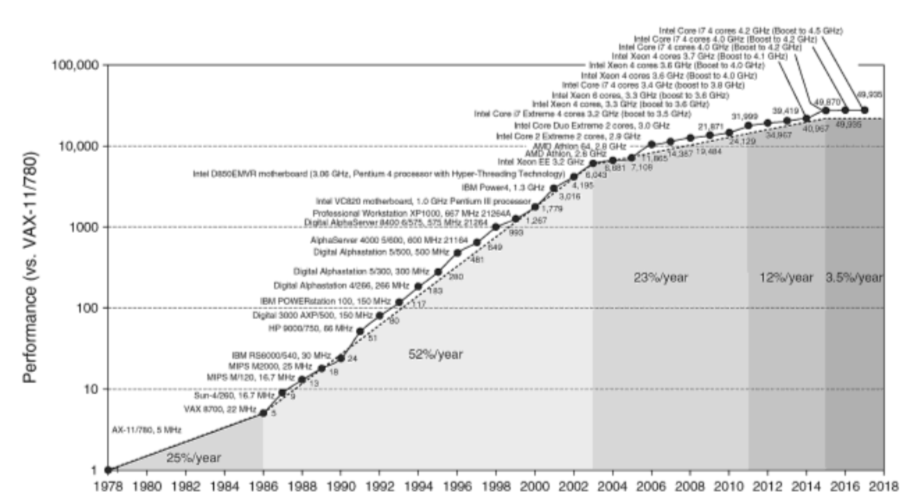

# Mourning Moore, or: Is that sexy RTX 3090 really worth [$3000](https://offer.ebay.com/ws/eBayISAPI.dll?ViewBidsLogin&item=254885216032)?

May 2021

David Eger

I’ve been playing around [fast.ai](https://www.fast.ai/) lately and
training image recognition models for different kinds of birds based
on labeled photos from Cornell's [Macaulay Library](https://www.macaulaylibrary.org/).
Thanks to crazy python compiler tricks like [JAX](https://github.com/google/jax),
[pytorch](https://pytorch.org/) and Nvidia's [CUDA](https://developer.nvidia.com/cuda-toolkit),
you can write codes in beautifully short Python and they get
jit’d into massively parallel programs that take advantage of thousands
of GPU, CPU, or TPU cores and their blindingly fast matrix multiplies.

My computer is about 8 years old, from a time when good consumer CPUs had 4 cores,
and long before those instantaneous matrix multiplying tensor cores were a
twinkle in Jensen Huang’s eye.

So when my machine decided to die a month ago, I wasn’t that
distraught.  My 4 CPU cores had been completely pegged during
ML training, and the death rattle of my elderly PC was a great excuse
to get a top-of-the-line ML workstation.  Everything, and I mean
everything, had *supposedly* much faster.

Lisa “Su is for Superwoman” launched Zen3 in Fall 2020 so there
were hot new sub-$1k AMD chips that scored
**[8x](https://www.cpubenchmark.net/cpu.php?cpu=AMD+Ryzen+9+5900X&id=3870)**
the cpumark of my now [geriatric Intel
CPU](https://www.cpubenchmark.net/cpu.php?cpu=Intel+Core+i5-3570K+%40+3.40GHz&id=828).
The new NVMe M.2 drives boasted **6.3x** the read speed of my ol’
SATA III SSD.  The Santa Clara sensation’s RTX 3090 now sported
**4x** the Cuda cores, shiny new tensor cores that do matrix
multiplies **9x faster**, and have **3x** the RAM of my now middle
aged GTX 1080.  And all that delicious training data could be
shoveled from host memory to GPU and back at twice the speed on
those hot new 16xPCIe 4.0 lanes.

Averaged together, I figured "a new top of the line should speed
my training up from 5 minutes per epoch to 1 minute per epoch!"
That sort of boost might be worth plonking down $3.5k on a new machine:
if ML training takes 12 minutes instead of an hour, that means you
can try a dozen ideas in an afternoon instead of just three as you're figuring
out what might work.

Unfortunately, those latest-and-greatest parts, especially the GPUs
were incredibly difficult to *get*, often simply unavailable or
fetching more than 2x their MSRP in the [secondary
markets](https://offer.ebay.com/ws/eBayISAPI.dll?ViewBidsLogin&item=254885216032).
So I ordered a pre-built, one of the few ways you could actually get an RTX 3090.
When I got it, I loaded up the monster
with [Ubuntu 21.04](https://ubuntu.com/blog/ubuntu-21-04-is-here)
straight off the presses, the bleeding edge [CUDA
11](https://developer.nvidia.com/cuda-toolkit), and strapped in to
find... approximately one iteration of Moore’s law in about a decade.

Comparing this high end PC built in April 2021 to a PC put together
for half the cost in ~2017, total training time for my birdie
image classifier went from about 62 minutes to 25 minutes.

## Old Rig
+ GPU: Gigabyte GTX 1080 (8GB RAM / launched 2016)
+ CPU: Core i5 3570K (4 core / launched 2012) - [cpumark of 4,921](https://www.cpubenchmark.net/cpu.php?cpu=Intel+Core+i5-3570K+%40+3.40GHz&id=828)
> NB: This rig as configured with 4x8GB DDR3 DIMMs showed actual cpumark of 5,454.

## New Rig
+ GPU: Geforce RTX 3090 (24GB RAM / launched 2020)
+ CPU: Ryzen 5900 (12 core / launched 2020, AMD) - [cpumark of 38,110](https://www.cpubenchmark.net/cpu.php?cpu=AMD+Ryzen+9+5900&id=4272)
> NB: This rig showed actual cpumark from 31.5k (1x16GB) to 34k (2x8GB @ 3200Mhz).

## Fastai CNN training (resnet34, fp32 over 67k jpegs)

Build Year | Build | batch size | CNN Training+Validation one epoch (seconds) | as MM:SS | speedup | speedup per year  
-----------|-------|-----------------------------------------|-------|---------|---------------|------
2017 | Core i5 3570K (‘12) + GTX 1080 (‘16) | 128 | 310 seconds | 5:10 | 1.0 |
2021 | Ryzen 5900 (‘20) + GTX 1080 (‘16)    | 128 | 189 seconds | 3:09 | 1.6x | 1.08x
2021 | Ryzen 5900 (‘20) + RTX 3090 (‘20)    | 128 | 127 seconds | 2:07 | 2.4x | 1.16x
2021 | Ryzen 5900 (‘20) + RTX 3090 (‘20)    | 350 | 119 seconds | 1:59 | 2.6x | 1.17x

The brand new high-end machine *is* faster, but for a coder of
my vintage the speed up is just sort of... underwhelming.
The 2010s had yielded a modest 1.6x speed up in CPU, or 6% per year.
GPUs had done a bit better with maybe 12% per year, and together they
eked out 17% compute gains per year over six years.
In my youth of the 1990s, we typically saw speed ups of 40% per year
on real-world tasks.  In five years, your machine would be 5x as fast,
not 2x as fast.  Taking a turn down the
[memory lane](https://books.google.com/books?id=elneMPYGaagC&lpg=PP1&pg=PA48-IA8#v=onepage&q&f=false)
of computers I once owned you can taste the time of infinite speedups:

## Benchmark: [Matrix factorization](https://3dfmaps.com/CPU/cpu.htm)

Launch | Build | CPU     | benchmark seconds | speedup  | per year
-------|-------|---------|-------------------|----------|---------
1985   |  1991 | 386/25  | 437 seconds       |  1.0     |
1992   |  1994 | 486DX2/66 | 50 seconds      |  8.7x    |  1.36x
1994   |  1997 | Pentium 100 | 15.7 seconds  |  27.8x   |  1.45x
1998   |  1999 | Pentium II 450 | 1.68 seconds | 260x   |  1.48x


## Benchmark: [Doom Frames per Second](https://www.complang.tuwien.ac.at/misc/doombench.html)

Launch | Build | CPU     | benchmark fps | speedup  | per year
-------|-------|---------|---------------|----------|---------
1992   |  1994 | 486DX2/66 | 35fps       |  1.0     |
1994   |  1997 | Pentium 100 | 73fps     |  2x      |  1.43x
1998   |  1999 | Pentium II 450 | 129fps |  3.68x   |  1.24x

# End of Moore's Law

In their latest edition of [Computer Architecture: A Quantitative Approach](https://www.amazon.com/Computer-Architecture-Quantitative-Approach-Kaufmann/dp/0128119055/) Hennesy and Patterson summ up what I've observed with a single
devastating chart:



Silicon's not getting faster (frequency wise), and there's a limited amount of miniaturization that will happen.  The big players have already leaned hard into speculative, out of order, superscalar architectures and throwing more cores at the problem.  Future performance improvements are likely to come only with quite specialized hardware (systolic arrays for example to do mat muls in TPU, computing in memory, or stacked VRAM to reduce memory latency) and figuring out how to make "[The top of the stack](https://science.sciencemag.org/content/368/6495/eaam9744)" more efficient with, for instance, JIT'ing infrastructure like [JAX+XLA](https://github.com/google/jax).

# Coda

After futzing about with my old rig, I discovered the cpu cooler
had gotten knocked off and just needed some new thermal paste.

The RTX 3090 is a beautiful piece of hardware whose RAM allows
training larger networks and larger batch sizes which can improve
training stability.

However, is it worth it to me to have this prebuilt at a markup
vs waiting a year for MSRP parts to become available when the
result is (only) a 2.5x speed up?  Am I going to be doing enough
full-time ML research to justify the cost of the upgrade
(which still needs some Noctuas to replace the shitty OEM fans)?
Maybe my old rig is good enough for me and this beast can go to
some intense gamer or VR enthusiast.

*Final Result:* SOLD to a VR enthusiast.

# Appendix

## Notes on ways to boost training performance.

### Mixed Precision Training

Modern NVidia cards can efficiently compute on half width
(16 bit) floats with those shiny tensor cores.  That means
faster results, bigger models and larger batch sizes can be
trained in the same video RAM envelope and that PCIe bandwidth
use is reduced.  This difference was negligible for smaller
networks and batch sizes, but noticeable for larger batches
and bigger networks.

Below are timings for one epoch runs on the new rig with the
single factory DIMM show speedups of using fp16 ranging
from 7% to 30%.

batch size | precision | model | epoch time | mixed precision improvement
-----------|-----------|-------|------------|------------
128 | fp16 | resnet34  | 1:58 | 7%
128 | fp32 | resnet34  | 2:06 |  -
128 | fp16 | resnet50  | 2:18 | 15% 
128 | fp32 | resnet50  | 2:43 |  -
128 | fp16 | resnet101 | 2:58 | 30%
128 | fp32 | resnet101 | 3:52 |  -

### Front loading JPEG Decompression (on CPU limited systems)

A lot of the CPU compute in my benchmark is spent de-compressing
JPEGs and preparing the tensors of training data.  While this wasn't
an issue for the 5900x, which rarely hit 40% CPU utilization, this
was certainly an issue for my 4 core Intel which was pegged
at 100% utilization the whole time.  4GB of training
JPEGs decompresses into 51GB of training PPMs.  Over the SATA 3 in
my old rig with maximal line rate of 600MB/s, this puts the lower bound
for simply reading the whole uncompresed data set on the old rig at 1:25.
Reading the compressed data set would be only 0:07.  However, because the
old rig was extremely CPU limited, doing this preprocessing separately
(which took 3:06 wall time) typically yield much improved training times,
especially on large batch sizes where the GPU had been idling, waiting for
the CPU to render (and augment) each batch of JPEG training data.

input |batch size | precision | model | epoch time | preprocessing improvement
------|-----------|-----------|-------|------------|---------------------------
jpg | 32 | fp16 | resnet34 | 4:53 |
ppm | 32 | fp16 | resnet34 | 4:37 |  5%
jpg | 32 | fp32 | resnet50 | 7:20 |
ppm | 32 | fp32 | resnet50 | 6:58 |  5%
jpg | 128 | fp16 | resnet34 | 4:55 |
ppm | 128 | fp16 | resnet34 | 3:55 |  20%
jpg | 128 | fp32 | resnet34 | 4:59 |
ppm | 128 | fp32 | resnet34 | 4:10 | 17%

### CPU and System Cooling

Training can run your system hot, and the last thing you want is
to thermal throttle your CPU or GPU to half its rated speed.
Make sure you're efficiently getting heat off of your CPU and out
of your case.  When I started, I didn't have sufficient airflow
and on some runs lost 20 seconds to thermal throttling.

### Larger Batch Sizes

Bigger batch sizes offer both more efficient use of your GPU cores and
better batch normalization to make your training more stable.
They also improve running times and are a good reason to get more VRAM
on your GPU.  On my old rig:

input |batch size | precision | model | epoch time | preprocessing improvement
------|-----------|-----------|-------|------------|---------------------------
ppm | 32 | fp16 | resnet34 | 4:37 |
ppm | 64 | fp16 | resnet34 | 3:55 | 15% 
ppm | 32 | fp32 | resnet34 | 4:34 |
ppm | 64 | fp32 | resnet34 | 4:13 |  8%
ppm | 32 | fp16 | resnet50 | 6:02 |
ppm | 64 | fp16 | resnet50 | 5:28 |  9%
ppm | 32 | fp32 | resnet50 | 6:58 |
ppm | 64 | fp32 | resnet50 | OOM  |  this is why you want a 3090.  

### Faster and More PCIe lanes

The B550A motherboard on the pre-built only had 8x PCIe 4.0 lanes for
the (one) graphics card slot instead of 16x PCIe 4.0, but nonetheless
those lanes were never very highly utilized.  Doubling the number of
lanes would double the speed of transfers, though Tim Dettmers advises
that this portion of your time is relatively small compared to the rest of your training.

### Better CPU and RAM

NVidia Nsight showed typical CPU utilization during training
of 30-40%, and most of that spent on JPEG decoding, so my guess
is that CPU cores were not a big limiting factor in training time
on the new rig, though going to a 5950X for its boost clock may be
worth the investment.  More memory lanes and overclocked RAM are
likely far more important for this data intensive benchmark.

The Ryzen series of processors offers up to 2 lanes of memory and the Threadrippers offer 4 lanes.
Due to a defective motherboard, I was only able to test the Ryzen 5900 with a single lane
of memory and observed performance far below expected CPU performance seen on Passmark (by 10-20%!)

Chip  |   CPU Mark | Single Thread | Clock | Turbo  | RAM Config | Memory Lanes | TDP
------|------------|---------------|-------|--------|------------|--------------|-------
Core i5 3570K (observed)  | 5,472 | 2,211 MOps/s | 3.4Ghz | 3.8 GHz | 4x 8GB DDR3 @1600Mhz, 13.25 ns min CAS | 2 | 77W
Ryzen 5900 (observed) | 31,581 | 3,536 MOps/s  | 3.0 GHz | 4.7 GHz  | 1x 16GB DDR4 @3200Mhz, 14.75 ns min CAS  | 1 | 65W
Ryzen 5900 (observed) | 33,802 | 3,536 MOps/s  | 3.0 GHz | 4.7 GHz  | 2x 16GB DDR4 @3200Mhz (in 2 banks) | 1 | 65W
Ryzen 5900 |  38,000 | 3,526 MOps/s | 3.0 GHz | 4.7 GHz | average | 2 | 65W
Ryzen 5900X | 39,479 | 3,494 MOps/s  | 3.7 GHz | 4.8 GHz | average | 2 | 105W
Ryzen 5950X | 46,118 | 3,499 MOps/s  | 3.4 GHz | 4.9 GHz | average | 2 | 105W
ThreadRipper 3970X | 64,228 | 2,711 MOps/s | 3.7 GHz | 4.5 GHz | average | 4 | 280W

Replacing the single DIMM that came with the prebuilt with two fast DIMMs
(each in its own bank, unfortunately) running at 3200Mhz with 13.75ns CAS
latency was able to bump up CPUMark to 34k, but this was still 10% lower than
the expected performance of a Ryzen 5900.  On average, adding a second DIMM
boosted speed up times vs my old rig from 2.4x to 2.8x (16% speedup) over
a range of parameters for CNN training.  I would love to know if having a
dual channel bank would improve things even more, but the motherboard (a B550A)
seemed to be somewhat defective and refused to accept a perfectly matched
kit in the first bank.  It's possible the CPU would have shown much greater performance
with a new motherboard.

On fast memory:  According to [this article](https://www.techspot.com/article/2140-ryzen-5000-memory-performance/),
getting more ranks and channels with high Mhz (-3200 or -3600) and low CAS RAM is your best bet for speeding up your CPU, and the author suggests you try to do this by filling up all four DIMM slots in your rig.
[This article](https://www.igorslab.de/en/performance-secret-tip-for-gamers-memory-ranks-in-theory-and-practice-with-cyberpunk-2077/3/)
runs benchmarks showing more ranks and channels leads to more performance (on average 5%) but also
warns that figuring out the number of ranks on any given DIMM you might buy is basically impossible due to marketing obfuscation, and even after installing it, micro-tuning the timings can make a sizable difference (though you'll likely agonize through a non-POSTing machine many times while you try to tune it).


### Host Memory Pinning

In order to reduce copy times, raw pytorch users use a technique
called host memory pinning.  However, in the version of fastai I was
using, the `pin_memory` option didn't seem to work.

## Benchmark Code

The benchmark I ran was fastai resnet training based on 4GB of jpegs from 246 bird
species from the Macaulay Database, each with between 50 and 450 examples.
A csv mapped jpeg images to labels, and the benchmark code was pretty standard fastai:

```py

from fastai.vision.all import *
import pandas as pd

bdf = pd.read_csv("simple_birder_split_df.csv")

def get_birdie_common_name(r):
    return r["Common Name"]

def get_birdie_filename(r):
    return r['fname']

def split_by_label(label_column='split'):
    def _inner(df: pd.DataFrame):
        if not isinstance(df, pd.DataFrame):
            print(f"This splitter is meant to work on dataframes with a column {class_name_column}")
        train_bools = (df.loc[:, label_column] == 'train')
        return df.loc[train_bools].index.values, df.loc[~train_bools].index.values, 
    return _inner

dblock = DataBlock(
    blocks = (ImageBlock, CategoryBlock),
    get_x = get_birdie_filename,
    get_y = get_birdie_common_name,
    splitter = split_by_label(),
    item_tfms = RandomResizedCrop(460, min_scale=0.85),
    batch_tfms = aug_transforms(size=224, min_scale=0.8) + [Normalize.from_stats(*imagenet_stats)]
)
dsets = dblock.datasets(bdf)

# The interesting outputs are the *timings* from this cell.
for batch_size in [64, 128, 256]:
    dls = dblock.dataloaders(bdf, bs=batch_size)
    for (model_name, model) in [("resnet34", resnet34),
                               ("resnet50", resnet50),
                               ("resnet101", resnet101)]:
        print(f"bs={batch_size}, fp16, {model_name}")
        learn16 = cnn_learner(dls, model, metrics=error_rate)
        learn16.to_fp16()
        learn16.fit_one_cycle(2, lr_max=3e-2)
        learn16 = None
        print(f"bs={batch_size}, fp32, {model_name}")
        learn32 = cnn_learner(dls, model, metrics=error_rate)
        learn32.to_fp32()
        learn32.fit_one_cycle(2, lr_max=3e-2)
        learn32 = None
 ```

